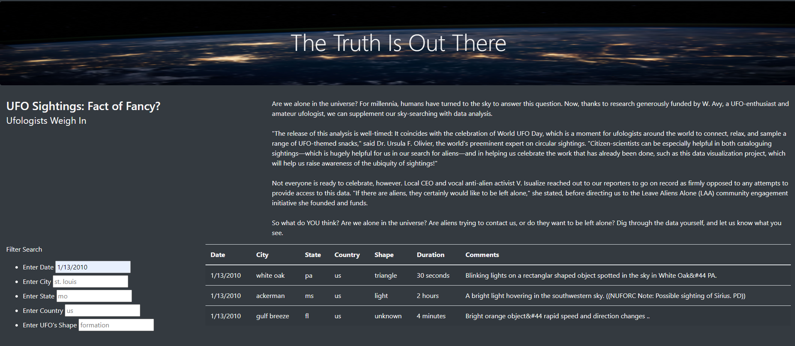

# Tracking UFOs

## ***Overview of Project:***
The purpose of this project was to utilize skills in JavaScript and HTML to publish UFO sighting data onto an interactive, user-friendly webpage. On our site, UFO enthusiasts can search for various UFO sighting by date, city, state, country, and shape of UFO. 
  

## ***Results:***

Here is an example of the website created with an input of date: 

 

An individual conducting research on UFO sighting can simply search in the input boxes which parameter they are seeking, whether that be the area, date, or type of sighting. Researchers could then conduct an analysis that may find correlations between the type of UFO and location or the date of UFO sighting and the type. Either one may be affected by those parameters, so this website could be a great resource for visitors. 

## ***Summary:***
 
There are a few drawbacks to this design. The first being that searches are case-sensitive, and the dates must be in a specific format of month/day/year. If a visitor wanted all the sighting from a specific year, he would have to search all of the days of that year, which is not a very efficient way of collecting information. Additionally, if there was a variance in capitalization when searching for a city, no results would come up, even if there are results. 
 
My suggestion would be to expand the code to include the ability to search for the year and to make searches insensitive to capitalization.

